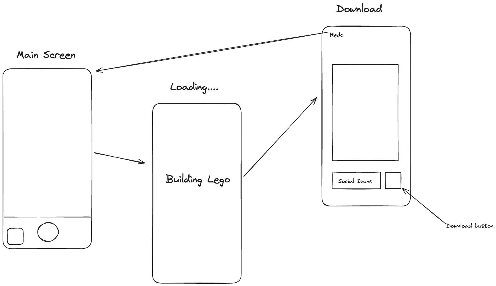

# Original App Design Project - README Template

# Legoify

## Table of Contents

1. [Overview](#Overview)
2. [Product Spec](#Product-Spec)
3. [Wireframes](#Wireframes)
4. [Schema](#Schema)

## Overview

### Description

An app that converts images into Lego form

### App Evaluation

### Mobile

- **Uniquely Mobile:** Strong use of mobile features like **camera access**, optional **photo library selection**, and **real-time API interaction**. The app leans into what makes mobile experiences fun and personal.
- **Beyond a Website:** While it could be built as a web app, native mobile makes the experience feel more **immediate and engaging**, especially with access to photos and device storage.

### Story

- **Compelling Narrative:** There's a fun, quirky, and visually compelling story—**turn your world into LEGO**. Great potential for shareability and social use.
- **Audience Clarity:** Easy for users (especially Gen Z and creatives) to understand the value immediately. It makes people **smile** and has strong viral potential.

### Market

- **User Base Potential:** Appeals to fans of LEGO, nostalgia, and creative self-expression—**a wide and diverse audience**.
- **Niche Value:** LEGO fans, creatives, and kids would love this. There's clear value even for a small group of enthusiasts.
- **Well-defined Audience:** Yep—casual users, hobbyists, and social media lovers.

### Habit

- **Habit-Forming Potential:** Medium. While not necessarily daily-use, it **encourages creation**, which is sticky.
- **User Creation:** Strong creative loop. Users are not just consuming—they’re **making something unique** every time.

### Scope

- **Feasible in a Week:** YES. You’ve already got the Stable Diffusion/OpenAI image gen plan, camera UI, and UI design scoped.
- **Stripped-Down Version Still Cool?** 100%. Even if it only converts and saves 1 image, it’s still worth showing off.
- **Clearly Defined?** Yes. Inputs → API → Output image → Save/Share. Well-scoped and achievable.

## Product Spec

### 1. User Stories

**Required Must-have Stories**

- [x] User can launch the app and see the camera screen
- [x] User can take a photo with the camera
- [x] User can select an image from their photo library instead of taking a photo
- [x] User sees a loading animation while the image is being processed
- [x] User sees the LEGO-ified result on a new screen
- [x] User can download the generated LEGO image to their device
- [x] User can navigate back to the camera screen from the results screen
- [x] User can switch between front and rear cameras

**Optional Nice-to-have Stories**

- [ ] User can share the LEGO image on social media
- [ ] User receives feedback if there’s a network error or timeout
- [ ] User sees a progress bar or better indicator during generation

---

### 2. Screen Archetypes

- **Camera Screen**

  - User can take a photo
  - User can choose an image from the photo library
  - User can toggle the camera between front and back

- **Loading Screen**

  - User sees an animated LEGO loader
  - App sends the image to OpenAI API for processing

- **Results Screen**
  - User views the LEGO-ified image
  - User can download the image to their device
  - User can go back to the Camera screen

---

### 3. Navigation

**Flow Navigation** (Screen to Screen)

- **Camera Screen**

  - → Loading Screen (after user captures or selects an image)

- **Loading Screen**

  - → Results Screen (after image generation finishes)

- **Results Screen**
  - → Camera Screen (on back button or after download complete if user chooses)

## Wireframes

### Networking

- Loading Screen request image from openai API
